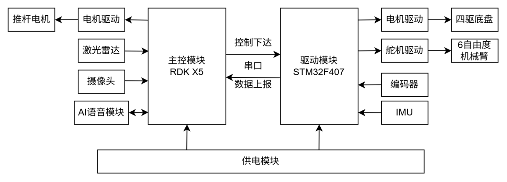
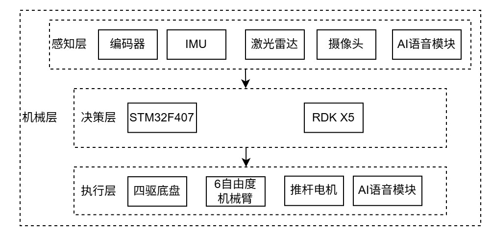

# Tool Handling and Management Robot Based on Deep Learning and SLAM

This project is built on the Digua RDK X5 ROS2 mobile robot platform. It integrates Cartographer SLAM, Nav2 navigation system, robotic arm manipulation, YOLO11-based visual detection, facial recognition, web-based management, and natural language voice interaction.

---

## Project Highlights

- Supports Cartographer for both real-time mapping and localization-only mode  
- Full navigation control pipeline with Nav2  
- Tool grasping with YOLO11 vision system based on Digua Robot BPU  
- Integrated facial recognition for check-in system  
- AI-based voice interaction for control  
- Web-based management system  

---

## System Overview

### Functional Module Diagram  

### System Architecture Diagram  

