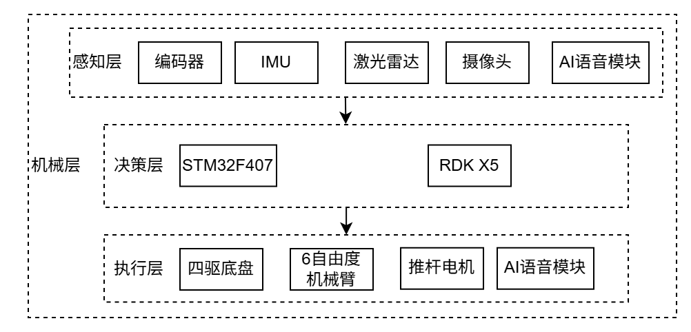

# 基于深度学习和SLAM的工具搬运管理机器人

本项目为基于地瓜RDK X5的ROS2移动机器人平台，集成 Cartographer SLAM、Nav2 导航系统、机械臂抓取，YOLO11，人脸识别，网页管理，自然语音交互等功能

---

## 项目亮点

- 支持 Cartographer 实时建图与纯定位模式
- Nav2 全流程导航控制
- 基于地瓜机器人 BPU 的 YOLO11 视觉机械臂工具抓取
- 集成人脸识别打卡
- AI 语音交互控制
- 提供网页管理系统

---

## 整体结构展示

### 整体功能模块图

### 整体架构图

